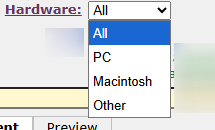

## 文前言

意外需要正式使用了...  
原本要調一調 [【雜記】自架 BugZilla](../Coding/雜記/【雜記】自架%20BugZilla.md) 那篇擴充，但發現架構太冗+那篇是雜記，因此改成開新篇。

v5.2

## 主文

### 建立 Product

建立帳號並登入後的首先：

點選上方導覽列內的 [Administration]  
然後 > [Products] > [Add] a product  
會看到以下畫面：


一開始有點疑惑為甚麼 Component 是必填，因此問了 Claude：
```md
## Bugzilla 的資料結構設計

Bugzilla 的 bug 追蹤系統採用階層式架構：

- **Product**（產品）
- **Component**（元件）← 必須存在
- **Bug**（問題單）

在這個設計中，每個 bug 必須同時關聯到一個產品和一個元件。這是 Bugzilla 資料庫架構的基本要求，bug 表格中的 component_id 欄位是必填的。

## 為什麼這樣設計

### 1. 責任歸屬的明確性

元件機制強制您在組織層面就思考清楚責任劃分。每個元件都必須指定預設負責人（Default Assignee），確保每個提交的 bug 都有明確的處理人員。

### 2. 避免過於粗糙的分類

如果只有產品層級，大型專案會面臨所有 bug 都混在一起的問題。強制使用元件可以防止這種情況，促使團隊進行更細緻的問題分類。

### 3. 通知機制的精準度

元件層級的 CC 清單和負責人設定，讓相關人員只接收到他們關心的領域的通知，避免資訊過載。

## 實務上的應對方式

如果您的專案確實很小或很簡單，不需要複雜的分類，可以採用以下策略：

### 最簡方案

建立一個通用元件，例如：

- 元件名稱：「General」或「Default」
- 描述：「一般性問題」或「未分類問題」

這樣至少滿足系統要求，之後如果專案成長需要更細的分類，再新增其他元件即可。

### 實際考量

即使是小專案，通常還是能找到基本的功能區分，例如：

- Frontend / Backend
- UI / API / Database
- Documentation / Code

這樣的基本分類對後續問題追蹤和統計分析也會有幫助。

## 結論

Bugzilla 強制要求元件不是為了增加複雜度，而是為了確保問題追蹤的品質和可維護性。這是系統設計的核心理念之一。如果您的使用場景真的非常簡單，建立一個預設的通用元件就能滿足需求，不會造成太大負擔。
```

因為個人還沒預備好要細分，因此先給名字「Default」。

[version] 欄位放上該系統目前已釋出的最新版本 (先簡單打個 1.0.0)  
[Default Assignee] 必填，所以先填了自己。(方式是打上自己的帳號，打到一部分的時候系統會自動跳出自己的下拉選項，選擇就好)  
[Default CC list] 非必填，個人還是選擇填自己

其他維持預設。

填寫結束後點選 [Add]。

### Component 帶模板

為了讓別人方便依照我想要的格式，決定改 Component 成兩個：  
Feature、Bug

這樣就可以各自給模板了！


### 回報 bug

點選右上角的 [New] 進入下圖頁面：


選擇要回報的 Product 進入下圖頁面：


#### 先來了解一下 Severity 吧：


> How severe the bug is, or whether it's an enhancement.

也就是 bug 的嚴重程度 or 純希望增強的功能。  
(以下名詞解釋都有參考網路)

- blocker: 
	- 完全阻止使用或測試系統 [^4] 
- critical: 
	- 嚴重影響產品使用，系統支援問題，安全性問題 [^1] 
	- 造成產品/服務無法使用 [^3] 
- major: 
	- 重要 [^2] 
	- 主要功能無法使用 [^3] 
- normal: 
	- 普通 [^2] 
- minor:
	- 次要 [^2] 
	- 功能無法使用/不如預期，但使用者可以自己找到解決方法，或不影響操作 [^3]
- trivial: 
	- 外觀或風格上的問題，對功能影響極小或沒有影響。 [^4] 
- enhancement: 
	- 不急著這個開發階段修正的小問題 [^1] 

#### Hardware



PC: 應該可以認知為 Windows 相關產品？  
Macintosh: 查網路得知是 Mac [^5]  
Other: 安卓的手機平板應該就填這裡了

#### 其他欄位

選擇想要回報的 [Component] 及 [Version]  

[Summary]  
如果有在回報 GitHub 之類的 issue 應該大概都知道要寫啥  
總之就是短小精煉 & 方便被後來人搜尋到關鍵字。  
以及內部公司使用記得界定好模板寫法。  
輸入期間底下會多出 [Possible Duplicates]，可以檢查一下有沒有類似的回報避免重複回報：  


[Description]  
似乎沒有支援 Markdown 語法？

[Attachment]  
要附上截圖啥的好地方。  
點選 [Add an attachment] 會得到下圖：  
  
看檔案大小限制，應該只能丟截圖。  
(略為翻了一下以前的影片檔，6秒就4千多kb了)


### 刪除 bug

ref: [How To Delete Bugs in Bugzilla – devZing Blog](https://devzing.com/blog/index.php/how-to-delete-bugs-from-bugzilla/)

官方建議是不要刪除，但我加了一個測試 email 有沒有寄信到我這裡的 bug 要怎麼刪除？

1. 上方導覽列 [Administration] > [Parameters] > [Administrative Policies]
2. 找到參數 `allowbugdeletion`，改成 [On]，然後 [Save Changes]
3. 接下來將該 bug 指派給新的 Component (這裡我如同參考網站內的作法，新增一個 `Trash` component)
4. 刪除該 component  
   
5. 把參數改回 [Off] > [Save Changes]

要注意的是該參數的描述：

> The pages to edit products and components can delete all associated bugs when you delete a product (or component). Since that is a pretty scary idea, you have to turn on this option before any such deletions will ever happen.
>   
> (在編輯產品及子產品的頁面刪除一項產品或子產品時，可以刪除所有相關的 bug。)


刪除該 component 會出現提示：  


所以如果可以的話，請不要刪掉 bug...

## UPDATE LOG

114.

12/02 開新篇


[^1]: [第七卷 - 嚴重不緊急的Bug要先修，還是緊急不嚴重的Request要先上？ - iT 邦幫忙::一起幫忙解決難題，拯救 IT 人的一天](https://ithelp.ithome.com.tw/articles/10288601)

[^2]: [Mozilla 技術傳教程序說明](https://www-archive.mozilla.org/projects/tech-evangelism/site/component-chinese-procedures)

[^3]: [[心得] Bug的分級與解決 - 看板 Soft_Job - 批踢踢實業坊](https://www.ptt.cc/bbs/Soft_Job/M.1654173453.A.C23.html)

[^4]: [Bug Severity Levels Explained (2025) – Definitions, Examples, and Best Practices](https://blog.qatestlab.com/2015/03/10/software-bugs-severity-levels/)


[^5]: [Mac (電腦) - 維基百科，自由的百科全書](https://zh.wikipedia.org/zh-tw/Mac_%28%E9%9B%BB%E8%85%A6%29)
