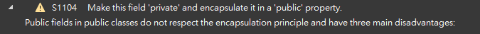

ref: [C# static code analysis](https://rules.sonarsource.com/csharp/)

## 前言

原本是為了對現有系統做源碼掃描，因為經費不足想找免費版  
於是翻到有人推薦 `SonarQube` 這支  
結果因為系統使用 MySQL，導致要另外處理的問題很多...

沒想到意外翻出  
[SonarLint × Visual Studio – 即時的程式碼靜態掃描工具 – Yohey66's Corner](https://yohey66.wordpress.com/2017/07/11/sonarlint-x-visual-studio-%E5%8D%B3%E6%99%82%E7%9A%84%E7%A8%8B%E5%BC%8F%E7%A2%BC%E9%9D%9C%E6%85%8B%E6%8E%83%E6%8F%8F%E5%B7%A5%E5%85%B7/)  
這篇文章，因此實際裝了 SonarLint 來試試看  
由於感覺不錯，因此記下。

詳細安裝教學請看上方網站。  
本篇只會出現各警告如何處理的我流寫法。

<!-- more -->
## S1104

  
[C# static code analysis | cwe](https://rules.sonarsource.com/csharp/tag/cwe/RSPEC-1104/) / Fields should not have public accessibility


## S1939

## S2325
## S2696

> This rule raises an issue each time a static field is updated from a non-static method or property.

## S3358


## 其他

### S125

```
Commented-out code distracts the focus from the actual executed code. It creates a noise that increases maintenance code. And because it is never executed, it quickly becomes out of date and invalid.
```

簡單來說，就是註解應當移除  
這個就看個人抉擇了。

