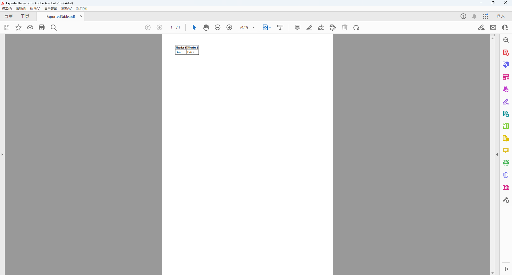

## 文前言

原本只要寫給 TuesPechkin，但因為意外所以也要加寫 PDFSharp...

加註：為了回來寫 PDFToImage 所以 ;)

<!-- more -->

## 主文
### `TuesPechkin`

!!! info  
	前言：由於網路上找不到 webform 版本將學，決定自我摸索後寫成文章。  
	反正實務上必須做出來，不如加寫成文章整理給未來的自己...


嘗試使用套件 TuesPechkin 來將 .aspx 內特定 html 產成 pdf 並下載。  
官方 repo: [tuespetre/TuesPechkin: A .NET wrapper for the wkhtmltopdf library with an object-oriented API.](https://github.com/tuespetre/TuesPechkin)

參照 [使用TuesPechkin將html轉成PDF檔---1(C#) | Leon的程式心得 - 點部落](https://dotblogs.com.tw/Leon-Yang/2021/01/21/174529) 此篇，安裝兩個套件：`TuesPechkin`、`TuesPechkin.Wkhtmltox.AnyCPU`
> 個人專案沒有需要指定位元，所以就依照 webform 預設裝了 AnyCPU

再參照  

- [tuespetre/TuesPechkin: A .NET wrapper for the wkhtmltopdf library with an object-oriented API.](https://github.com/tuespetre/TuesPechkin?tab=readme-ov-file#5-putting-it-all-together)
- [c# - Hanging TuesPechkin after initial conversion - Stack Overflow](https://stackoverflow.com/questions/28037517/hanging-tuespechkin-after-initial-conversion)  
- [使用TuesPechkin將html轉成PDF檔---2(C#) | Leon的程式心得 - 點部落](https://dotblogs.com.tw/Leon-Yang/2021/01/22/135047)  

兩篇來配置初始化 (自己客製化為需求)

最終：  
(前端 .aspx: 為求方便，將想輸出成 pdf 的區塊寫了 `d-none`。其他不需要輸出的就放著)
``` aspx
...
<table id="myTable" runat="server" border="1" class="d-none">
    <tr>
        <th>Header 1</th>
        <th>Header 2</th>
    </tr>
    <tr>
        <td>Data 1</td>
        <td>Data 2</td>
    </tr>
</table>
...
```

(後端 .aspx.cs: 抓取前端的 id 輸出)
``` csharp
...

HtmlTable tableControl = myTable;

if (tableControl != null)
{
    StringBuilder sb = new StringBuilder();
    using (StringWriter sw = new StringWriter(sb))
    {
        using (HtmlTextWriter hw = new HtmlTextWriter(sw))
        {
            tableControl.Visible = true; // 確保可見性以渲染 HTML
            tableControl.RenderControl(hw);
        }
    }

    string tableHtml = sb.ToString();
    
	IConverter converter = new StandardConverter(
			                new RemotingToolset<PdfToolset>(
				                // Win64... 類別請依照前面套件裝的位元調整
				                // 例如我的是 WinAnyCPUEmbeddedDeployment
			                    new Win64EmbeddedDeployment(
				                    new TempFolderDelpoyment()
								)
							)
						);
	
	var document = new HtmlToPdfDocument
					{
						GlobalSettings =
						{
							ProduceOutline = true,
							DocumentTitle = "Converted Form",
							PaperSize = PaperKind.A4,
							Margins =
							{
								All = 1.375,
								Unit = Unit.Centimeters
							}
						},
						Objects =
						{
							new ObjectSettings { HtmlText = tableHtml }
						}
					};
	
	byte[] pdfBuffer = converter.Convert(document);

	//設定標頭
	Response.AddHeader("Content-disposition", "attachment; filename=ExportedTable.pdf");
	Response.ContentType = "application/pdf";
	Response.BinaryWrite(pdfBuffer);
	Response.End();
}
...
```

後端內類別名稱的部分參照：  
[Type 'Win32EmbeddedDeployment' is not defined · Issue #177 · tuespetre/TuesPechkin](https://github.com/tuespetre/TuesPechkin/issues/177)

這樣就完成下載匯出的 pdf 了，產出如下圖。




### `PDFSharp`

基本寫法就不放了，網路上教學很多 (主要是隔太久不記得惹)  
這次是來放多檔案合併。

ref: [c# - Combining multiple PDFs using PDFSharp - Stack Overflow](https://stackoverflow.com/questions/4995263/combining-multiple-pdfs-using-pdfsharp)

1. `<asp:FileUpload runat="server" .../>` 要加上 `AllowMultiple="true"` 才能接受多檔案
2. 後端參數不論單檔多檔都是用 `FileUpload file` (`file` 是自訂參數名)

- 檢查上傳幾個檔案：`file.PostedFiles.Count`
- 合併檔案使用：`PdfDocument outputDocument = new PdfDocument();`


後端範例：(有包含 FTP 上傳)

```cs
using PdfSharp.Pdf;  
using PdfSharp.Pdf.IO;

...


if (file.PostedFiles.Count > 1)  
{  
	// 如果有多個檔案，則合併 PDF 檔案  
	PdfDocument outputDocument = new PdfDocument();  

	foreach (HttpPostedFile postedFile in file.PostedFiles)  
	{  
		// 讀取 PDF 並加入合併  
		using (MemoryStream ms = new MemoryStream())  
		{  
			// 將檔案內容從 InputStream 複製到 MemoryStream  
			postedFile.InputStream.CopyTo(ms);  
			ms.Position = 0;  // 重置記憶體流的指標  

			PdfDocument inputDocument = PdfReader.Open(ms, PdfDocumentOpenMode.Import);  
			// 單檔內若有多頁則也循環加入
			foreach (PdfPage page in inputDocument.Pages)  
			{  
				outputDocument.AddPage(page);  
			}  
		}  
	}  

	// 合併後的檔案儲存到記憶體  
	using (MemoryStream outputStream = new MemoryStream())  
	{  
		outputDocument.Save(outputStream, false); // 不寫入檔案系統  

		// 儲存合併後的 PDF 到 FTP  
		FtpWebRequest ftpRequest = (FtpWebRequest)WebRequest.Create(filePath);  
		...
		ftpRequest.ContentLength = outputStream.Length;  

		// 上傳檔案到 FTP  
		using (Stream requestStream = ftpRequest.GetRequestStream())  
		{  
			outputStream.WriteTo(requestStream);  
		}  

		using (FtpWebResponse response2 = (FtpWebResponse)ftpRequest.GetResponse())
		{  
			// response2.StatusDescription
		}  
	}  
}
```


這段感謝 ChatGPT 發想，個人再調整為想要的部分


### `PDFToImage`

套件如其名，是 pdf 轉圖片版用

套件路徑：[NuGet Gallery | PDFtoImage 5.1.0-preview6](https://www.nuget.org/packages/PDFtoImage/5.1.0-preview6)  
套件來源：[sungaila/PDFtoImage: A .NET library to render PDF files into images.](https://github.com/sungaila/PDFtoImage)

簡易用法：  
(pdf 路徑轉存 jpg 檔並存入指定路徑)
```cs
using (FileStream inputStream 
		= new FileStream(pdf 路徑, FileMode.Open, FileAccess.Read))
{
    Conversion.SaveJpeg(輸出檔案路徑, inputStream);
}
```

多頁轉檔 png：  
(此段參考  
原始碼內測試檔寫法：

- [PDFtoImage/src/Tests/ComparisonTests.cs at dd877108a60d42f7fe6cda03357d9bc00aacd35d · sungaila/PDFtoImage](https://github.com/sungaila/PDFtoImage/blob/dd877108a60d42f7fe6cda03357d9bc00aacd35d/src/Tests/ComparisonTests.cs#L83)  
- [PDFtoImage/src/Tests/TestUtils.cs at master · sungaila/PDFtoImage](https://github.com/sungaila/PDFtoImage/blob/master/src/Tests/TestUtils.cs#L72)  

& ChatGPT)
```cs
string savePng;
using (FileStream inputStream 
	= new FileStream(pdf 路徑, FileMode.Open, FileAccess.Read, FileShare.Read, 4096, FileOptions.SequentialScan))
{
    int page = 0;

    foreach (SKBitmap image in Conversion.ToImages(inputStream))
    {
        savePng = $"xxx/{page + 1}.png";

        using (Stream outputStream = CreateOutputStream(savePng))
        {
            image.Encode(outputStream, SKEncodedImageFormat.Png, 100);
        }

        page++;
    }
}

private static Stream CreateOutputStream(string expectedPath)
{
    if (!File.Exists(expectedPath))
        return new FileStream(expectedPath, FileMode.CreateNew, FileAccess.ReadWrite, FileShare.None, 4096, FileOptions.SequentialScan);
    else
        return new MemoryStream();
}
```


取得 pdf 頁數：  
ref: [PDFtoImage/src/PDFtoImage/PublicAPI/net481/PublicAPI.Shipped.txt at 26a33fcf18b1516926d6ff791fe9b3fbf9f2165f · sungaila/PDFtoImage](https://github.com/sungaila/PDFtoImage/blob/26a33fcf18b1516926d6ff791fe9b3fbf9f2165f/src/PDFtoImage/PublicAPI/net481/PublicAPI.Shipped.txt#L91)

```c#
Conversion.GetPageCount(xxx);
```